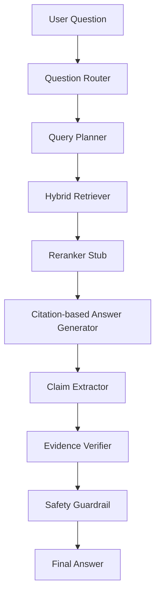

# ClinicalClaw: Clinical Agentic RAG with Evidence Verification

ClinicalClaw is a research-oriented, beginner-friendly scaffold for learning how a clinical agentic retrieval-augmented generation system can be assembled. It focuses on clear module boundaries, testable toy behavior, and explicit TODOs for the serious research work.

> Safety disclaimer: This project is a research prototype for education only. It is not a medical product, clinical decision support system, diagnosis tool, or substitute for a qualified clinician. Demo answers may be incomplete or wrong.

## Motivation

Clinical QA is a useful setting for studying agent runtimes, retrieval, citation grounding, evidence verification, and safety guardrails because mistakes can look fluent while still being unsupported. This scaffold keeps the first implementation simple enough to inspect, then marks the places where real retrieval, verification, and evaluation should replace toy logic.

## Architecture



## Modules

- `clinicalclaw.models` defines shared dataclasses for documents, retrieval results, claims, verification results, safety decisions, and final answers.
- `clinicalclaw.data.pubmedqa` contains a PubMedQA loader stub with a built-in tiny sample and JSONL normalization.
- `clinicalclaw.retrieval` contains BM25 retrieval, deterministic mock dense retrieval, hybrid score fusion, and a reranker placeholder.
- `clinicalclaw.llm` and `clinicalclaw.generation` contain a mock LLM provider and citation-based answer generator stub.
- `clinicalclaw.verification` contains claim extraction and evidence verification stubs.
- `clinicalclaw.safety` contains a minimal safety policy for research-only medical QA.
- `clinicalclaw.evaluation` contains metric skeletons for retrieval and faithfulness experiments.
- `clinicalclaw.pipeline` wires the components into a minimal end-to-end demo.

## Run The Demo

From the project root:

```bash
python examples/demo.py
```

Or:

```bash
python -m clinicalclaw.pipeline.demo
```

The demo uses the built-in tiny PubMedQA-style sample, retrieves evidence, generates a citation-bearing answer, extracts claims, verifies them with simple lexical overlap, applies the safety policy, and prints the final answer with the research disclaimer.

## Run Tests

```bash
pytest
```

The tests cover dataset loading, BM25 ranking, hybrid score fusion, claim schema shape, verifier schema shape, and safety policy decisions.

## Experiment Plan

1. Start with naive medical RAG over the tiny sample and inspect every intermediate object.
2. Replace the mock dense retriever with a real embedding model.
3. Add FAISS or Chroma for vector search and compare retrieval quality against BM25.
4. Add a reranker and evaluate whether citations become more relevant.
5. Replace the stub verifier with a real NLI or entailment verifier.
6. Add MedQA and MedMCQA evaluation harnesses.
7. Add medical prompt injection tests and claim-level faithfulness metrics.
8. Write a report in `reports/` describing failure modes and future research directions.

## Completing The TODOs

- `TODO: real embedding model` appears in the mock dense retriever. Replace deterministic toy scores with embeddings from a medical or general embedding model.
- `TODO: FAISS/Chroma integration` appears in retrieval notes. Add a vector store module and persist indexes under `data/indexes/`.
- `TODO: reranker` appears in the reranker stub. Add a cross-encoder or LLM reranker with reproducible scoring.
- `TODO: LangGraph workflow` appears in the pipeline. Convert the linear workflow into an explicit graph with recoverable node state.
- `TODO: MedQA and MedMCQA evaluation` appears in the metrics module. Add dataset adapters and standardized evaluation scripts.
- `TODO: real NLI verifier` appears in evidence verification. Replace lexical matching with entailment, contradiction, and insufficiency labels.
- `TODO: medical prompt injection tests` appears in safety tests. Add adversarial instructions that try to override citation and safety behavior.
- `TODO: claim-level faithfulness metrics` appears in evaluation. Score support at the individual claim level, not only answer level.

Keep the safety disclaimer in all demos and reports. ClinicalClaw should be a learning scaffold before it is anything else.
