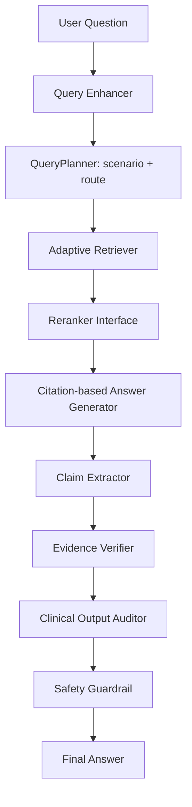
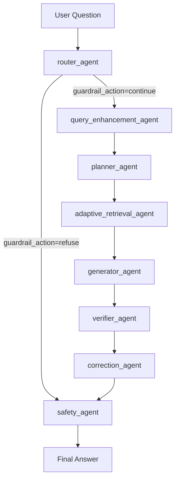

# ClinicalClaw: Clinical Agentic RAG with Evidence Verification

ClinicalClaw is a clinical agentic RAG research prototype for studying evidence-grounded medical question answering. It is organized as three experimental layers:

1. Pure Python baseline RAG for controlled ablation studies.
2. Optional LangGraph multi-agent orchestration.
3. Extension points for real LLMs, vector search, verifier models, and evaluation harnesses.

> Safety disclaimer: This project is a research prototype only. It is not a medical product, clinical decision support system, diagnosis tool, or substitute for a qualified clinician. Experimental outputs may be incomplete or wrong.

## Motivation

Clinical QA is a useful setting for studying agent runtimes, retrieval, citation grounding, evidence verification, and safety guardrails because mistakes can look fluent while still being unsupported. ClinicalClaw keeps the baseline implementation explicit and reproducible, then isolates the components where production-grade retrieval, verification, and evaluation can be introduced.

## Research Plan Alignment

| Proposal objective | ClinicalClaw implementation |
| --- | --- |
| RQ1: scenario-and-complexity-aware adaptive retrieval | `QueryPlanner` uses query complexity internally, then returns `QueryPlan` with clinical scenario, retrieval route, and subqueries for `AdaptiveRetriever` |
| RQ2: clinical rules for retrieval input and generation output safety | `ClinicalQueryEnhancer`, terminology mapping, `ClinicalOutputAuditor`, `SafetyPolicy` |
| RQ3: clinical-specific evaluation beyond generic NLP metrics | retrieval metrics, claim support metrics, unsafe-output flag rate, TODOs for MedQA/MedMCQA/MMLU-Med and clinician review |
| RQ4: real-world clinical validation | research report alignment and pilot-readiness TODOs; no clinical deployment behavior |

## Architecture: Baseline Mode



## Architecture: Agentic Mode



The agentic mode uses LangGraph as an orchestration layer. Each graph node is a thin wrapper around the same controlled components used by the baseline pipeline, so experiments can compare linear and graph-based orchestration without changing retrieval or verification logic.

## Modules

- `clinicalclaw.models` defines shared dataclasses for documents, retrieval results, claims, verification results, safety decisions, and final answers.
- `clinicalclaw.data.pubmedqa` contains a PubMedQA loader baseline with a built-in sample and JSONL normalization.
- `clinicalclaw.pipeline.router.QueryPlanner` uses query complexity internally, then produces the public query plan: clinical scenario, retrieval route, and subqueries. It can optionally use an OpenAI-compatible LLM, with deterministic rules as fallback.
- `clinicalclaw.query_enhancement` maps colloquial consultation terms to retrieval-oriented medical terms.
- `clinicalclaw.retrieval` contains BM25 retrieval, deterministic dense-retrieval baseline, hybrid score fusion, adaptive retrieval, and a reranker interface.
- `clinicalclaw.llm` and `clinicalclaw.generation` contain a deterministic LLM-provider baseline and citation-based answer generator.
- `clinicalclaw.verification` contains claim extraction and evidence verification baselines.
- `clinicalclaw.correction` contains a post-generation clinical output audit baseline.
- `clinicalclaw.safety` contains a minimal safety policy for research-only medical QA.
- `clinicalclaw.evaluation` contains metric skeletons for retrieval and faithfulness experiments.
- `clinicalclaw.pipeline` wires the components into a minimal end-to-end baseline experiment.
- `clinicalclaw.agentic` adds an optional LangGraph workflow with retrieval-route planning, retrieval, generation, verification, correction, and safety agents.

## Implementation Strategy

ClinicalClaw keeps core algorithms explicit so baseline behavior can be audited and used as a regression oracle. BM25 scoring, score fusion, citation formatting, claim extraction, and safety decisions remain plain Python. LangChain and LangGraph are introduced where they help most: graph state, agent boundaries, orchestration, future tool calling, and later observability.

Useful references:

- [LangChain retrieval docs](https://docs.langchain.com/oss/python/langchain/retrieval)
- [LangChain RAG agent docs](https://docs.langchain.com/oss/python/langchain/rag)
- [LangChain multi-agent docs](https://docs.langchain.com/oss/python/langchain/multi-agent)
- [LangSmith RAG evaluation tutorial](https://docs.langchain.com/langsmith/evaluate-rag-tutorial)

## Run Experiments

From the project root:

```bash
python examples/demo.py
```

Run the optional LangGraph agentic experiment:

```bash
python examples/agentic_demo.py
```

Pass your own question:

```bash
python examples/agentic_demo.py "Can antibiotics treat viral influenza?"
```

Inspect adaptive retrieval:

```bash
python examples/retrieval_experiment.py
```

The adaptive evaluation uses deterministic planning by default so its metrics remain reproducible. Compare the configured LLM planner explicitly with:

```bash
python examples/evaluate_adaptive_retrieval.py --use-llm
```

Compare baseline and agentic proposal-aligned behavior:

```bash
python examples/research_plan_demo.py
```

If LangGraph is not installed:

```bash
pip install -e ".[agentic]"
```

To experiment with optional LLM-based query planning:

```bash
pip install -e ".[llm]"
```

Then set `DEEPSEEK_API_KEY`, optional `DEEPSEEK_API_URL`, and optional `DEEPSEEK_MODEL` in your shell, `.env`, or `configs/.env`. The planner falls back to local rules when no LLM configuration is available or when the LLM output is invalid.

The `agentic` extra requires LangChain/LangGraph v1.x:

```toml
langchain>=1.0,<2.0
langchain-core>=1.0,<2.0
langgraph>=1.0,<2.0
```

The experiment runners prefer a bounded subset of the local original PubMedQA release at `data/PubMedQA/ori_pqaa.json` (up to 100 examples). They fall back to the built-in PubMedQA-style sample when the large local release is unavailable. The runners enhance queries, adapt retrieval strategy, generate citation-bearing answers, extract claims, verify them with lexical-overlap evidence checks, audit outputs, apply the safety policy, and print results with the research disclaimer.

## Load Local PubMedQA Data

If the original PubMedQA files are available under `data/PubMedQA/ori_pqa*.json`, load a small bounded sample during development:

```python
from clinicalclaw.data import load_pubmedqa

examples = load_pubmedqa("data/PubMedQA", limit=100)
```

The loader supports PubMedQA JSON object files keyed by PubMed ID, JSONL samples, JSON arrays, directories, and glob patterns. Use `limit` while iterating because the original files are large. Demo code uses `load_research_pubmedqa(limit=100)` to select the local dataset when available and retain a clean-checkout fallback.

## Routing Rules

Query planning reads deterministic markers from `configs/routing_rules.json` and the three LLM system messages from `configs/routing_prompts.json`. Edit these files when you want to change routing behavior or prompt wording without touching Python code. If either file is missing or invalid, the planner uses a minimal safe fallback and continues to run.

## Run Tests

```bash
pytest
```

The tests cover dataset loading, query enhancement, adaptive retrieval, BM25 ranking, hybrid score fusion, claim schema shape, verifier schema shape, output audit, evaluation metrics, safety policy decisions, LangGraph orchestration, and v1 dependency constraints.

## Reports

- [Project summary](reports/project_summary.md)
- [Research plan alignment](reports/research_plan_alignment.md)
- [Current research report](reports/clinicalclaw_report.md)

## Experiment Plan

1. Establish a naive medical RAG baseline over the included PubMedQA-style sample.
2. Evaluate retrieval routes against simple, associative, and reasoning queries.
3. Replace deterministic terminology mapping with MeSH/UMLS-backed enhancement.
4. Replace the deterministic dense-retrieval baseline with a real embedding model.
5. Add FAISS or Chroma for vector search and compare retrieval quality against BM25.
6. Add a reranker and evaluate whether citations become more relevant.
7. Replace the lexical verifier and output auditor with real NLI and clinical correction models.
8. Add MedQA, MedMCQA, and MMLU-Med evaluation harnesses.
9. Add medical prompt injection tests, clinician review rubrics, and claim-level faithfulness metrics.
10. Optionally use LangSmith to organize RAG evaluation runs.

## Completing The TODOs

- `TODO: real embedding model` appears in the deterministic dense retriever. Replace deterministic baseline scores with embeddings from a medical or general embedding model.
- `TODO: FAISS/Chroma integration` appears in retrieval notes. Add a vector store module and persist indexes under `data/indexes/`.
- `TODO: reranker` appears in the reranker interface. Add a cross-encoder or LLM reranker with reproducible scoring.
- `clinicalclaw.agentic` contains the first LangGraph workflow. Extend it with real LangChain chat models and tool-calling once model choices are configured.
- `TODO: MedQA and MedMCQA evaluation` appears in the metrics module. Add dataset adapters and standardized evaluation scripts.
- `TODO: real NLI verifier` appears in evidence verification. Replace lexical matching with entailment, contradiction, and insufficiency labels.
- `TODO: medical prompt injection tests` appears in safety tests. Add adversarial instructions that try to override citation and safety behavior.
- `TODO: claim-level faithfulness metrics` appears in evaluation. Score support at the individual claim level, not only answer level.
- `configs/default.yaml` marks LangSmith as optional. Use it later for experiment tracking, not as a required runtime dependency.
- `configs/routing_rules.json` contains deterministic fallback markers for internal query complexity, clinical scenario, and retrieval route. Treat it as the local baseline before training or prompting a stronger router.

Keep the safety disclaimer in all experiment runners and reports. ClinicalClaw should remain a reproducible research prototype, not a clinical product.
